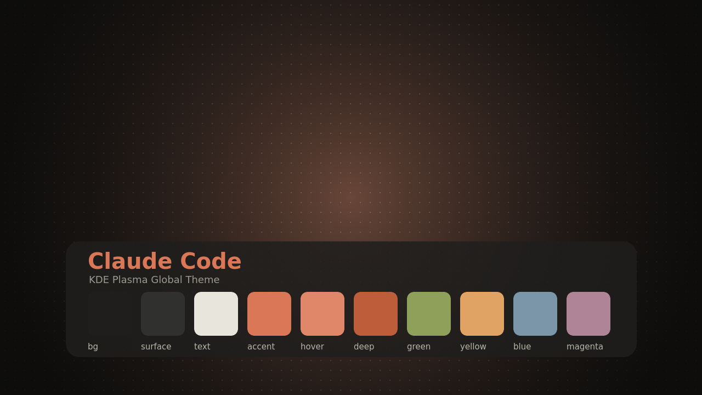

# Claude Code — KDE Plasma Theme

A warm-dark KDE Plasma 6 **Global Theme** inspired by the look of Claude Code:
a near-black warm background, the signature **Claude coral** accent (`#D97757`),
ivory text, and a wallpaper with a soft centered coral glow over a `+` dot-grid.

Includes matching color schemes for **Konsole** and **Alacritty**.

> ⚠️ **Unofficial community theme.** Not affiliated with, endorsed by, or produced
> by Anthropic. "Claude" and "Claude Code" are trademarks of Anthropic — this is a
> fan-made desktop theme that borrows the color palette.



## Palette

| Role            | Hex        |
|-----------------|------------|
| Background      | `#1F1E1D`  |
| Panel / alt bg  | `#262624`  |
| Elevated        | `#30302E`  |
| Text            | `#E8E6DC`  |
| Bright text     | `#F0EEE6`  |
| Muted text      | `#7C7A72`  |
| **Accent (coral)** | `#D97757` |
| Coral hover     | `#E0876A`  |
| Coral deep      | `#BD5D3A`  |
| Wallpaper base  | `#1B1A19`  |
| Dot-grid marks  | `#E0CDB8`  |

## What's included

```
colors/        Plasma color scheme (ClaudeCode.colors)
lookandfeel/   Global Theme package (com.hody.claude-code)
wallpaper/     Wallpaper KPackage (3840×2160 PNG + metadata)
konsole/       Konsole color scheme + profile
alacritty/     Importable alacritty color file
scripts/       generate-wallpaper.sh (reproduce the wallpaper at any size)
install.sh / uninstall.sh
```

## Install

```bash
git clone https://github.com/HodyTech/claude-code-theme.git
cd claude-code-theme
./install.sh
```

Then pick **Claude Code** in *System Settings → Colors & Themes → Global Theme*.

For Alacritty, add to `~/.config/alacritty/alacritty.toml`:

```toml
[general]
import = ["~/.config/alacritty/claude-code.toml"]
```

For Konsole, *Settings → Switch Profile → Claude Code* (or set it as default).

### Manual / KDE Store install of just the Global Theme

```bash
kpackagetool6 --type Plasma/LookAndFeel --install lookandfeel/com.hody.claude-code
```

## Uninstall

```bash
./uninstall.sh
```
(Switch to another Global Theme first if Claude Code is active.)

## Regenerate the wallpaper

```bash
scripts/generate-wallpaper.sh my-wallpaper.png 2560x1440   # any resolution
```

## License

MIT © Hodahel Moinzadeh (HodyTech) — see [LICENSE](LICENSE).
The wallpaper is generated from gradients and shapes (no third-party assets).
